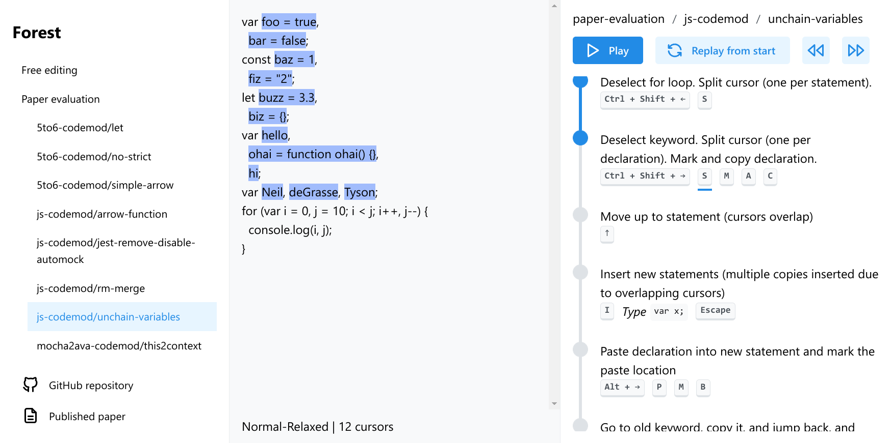

# Forest

## What is this?

Forest is a _multi-cursor structural editor_ for TypeScript.

Being structural means that most editing commands modify the [AST](https://en.wikipedia.org/wiki/Abstract_syntax_tree) of the program and the text is printed to match. In Forest code is still shown as text and new code can be typed almost normally, but under the hood it's very different from a normal text editor.

Forest is also built from the ground up with multi-cursor editing in mind. It's the only structural editor which specially integrates multi-cursor features. This makes Forest an interactive equivalent to AST refactoring scripts (like jscodeshift scripts). By using the right combination of commands with multiple cursors, you can accomplish some tasks that you might normally write basic scripts for.

## Demo

You can [try Forest in your browser](https://forest.walr.is/) without installing anything. It's a prototype, so some basic features are unsupported. Hopefully this rough version still gives you a feeling for what multi-cursor structural editing could be like in practice.

## Paper

Our paper _Forest: Structural Code Editing with Multiple Cursors_ ([published version](https://doi.org/10.1145/3563835.3567663), [preprint](https://arxiv.org/abs/2210.11124)) looks at Forest from an academic point of view. If you're interested in understanding the concepts behind Forest or how it compares to other editing approaches, this could be an interesting read.
